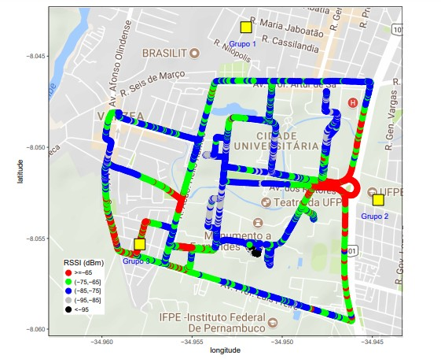

# Arquivos Projeto Localização PCOM
Contém dados de Localização para projeto da disciplina PCOM

# Descriminação das Colunas nos arquivos

## Bts.csv - Arquivos com Dados da BTS.

Arquivo com dados das BTSs. 

| Coluna  | Descrição |
| ------------- | ------------- |
| grupo  | Localização do setor  |
| btsId  | Identificador da BTS  |
| btsNetNome  | Nome da BTS |
| lat  | latitude da BTS  |
|lon  | longitude da BTS  |
| cch  | Canal de Controle BTS  |
| azimuth | Azimute da Antena da BTS  |
| RssiId |Identificador no arquivo de medições (treino/test) |

## meds_train_alunos.csv - Arquivos de Treino para os alunos

Esse arquivo deve ser utilizado para treinar os modelos de Machine Learning.

| Coluna  | Descrição |
| ------------- | ------------- |
| ponto_id  | Identificadro do Ponto|
| rssi_1_1 | Intensidade do Sinal (Received signal strength indication) BTS com RssiId=rssi_1_1|
| rssi_1_2 | Intenidade do Sinal (Received signal strength indication) BTS com RssiId=rssi_1_2|
| rssi_1_3 | Intensidade do Sinal (Received signal strength indication) BTS com RssiId=rssi_1_3|
| rssi_2_1 | Intensidade do Sinal (Received signal strength indication) BTS com RssiId=rssi_2_1|
| rssi_2_2 | Intenidade do Sinal (Received signal strength indication) BTS com RssiId=rssi_2_2|
| rssi_2_3 | Intensidade do Sinal (Received signal strength indication) BTS com RssiId=rssi_2_3|
| rssi_3_1 | Intensidade do Sinal (Received signal strength indication) BTS com RssiId=rssi_3_1|
| rssi_3_2 | Intenidade do Sinal (Received signal strength indication) BTS com RssiId=rssi_2_2|
| rssi_3_3 | Intensidade do Sinal (Received signal strength indication) BTS com RssiId=rssi_3_3|
|delay_1|Atraso de Propagação Grupo 1|
|delay_2|Atraso de Propagação Grupo 2|
|delay_3|Atraso de Propagação Grupo 3|
|lat|latitude da medição (Não está no arquivo de test)|
|lon|longitude da medição (Não está no arquivo de test)|
|indoor|Se a medição em ambiente indoor (Não está no arquivo de test)|

## meds_test_alunos.csv - Arquivos de Test para os alunos

Esse arquivo dever ser utilizado para gerar as predições de localizações do arquivo *submit_alunos*.

| Coluna  | Descrição |
| ------------- | ------------- |
| ponto_id  | Identificador do Ponto (link com o submit file)|
| rssi_1_1 | Intensidade do Sinal (Received signal strength indication) BTS com RssiId=rssi_1_1|
| rssi_1_2 | Intenidade do Sinal (Received signal strength indication) BTS com RssiId=rssi_1_2|
| rssi_1_3 | Intensidade do Sinal (Received signal strength indication) BTS com RssiId=rssi_1_3|
| rssi_2_1 | Intensidade do Sinal (Received signal strength indication) BTS com RssiId=rssi_2_1|
| rssi_2_2 | Intenidade do Sinal (Received signal strength indication) BTS com RssiId=rssi_2_2|
| rssi_2_3 | Intensidade do Sinal (Received signal strength indication) BTS com RssiId=rssi_2_3|
| rssi_3_1 | Intensidade do Sinal (Received signal strength indication) BTS com RssiId=rssi_3_1|
| rssi_3_2 | Intenidade do Sinal (Received signal strength indication) BTS com RssiId=rssi_2_2|
| rssi_3_3 | Intensidade do Sinal (Received signal strength indication) BTS com RssiId=rssi_3_3|
|delay_1|Atraso de Propagação Grupo 1|
|delay_2|Atraso de Propagação Grupo 2|
|delay_3|Atraso de Propagação Grupo 3|

## submit_alunos.csv - Contém as predições para o arquivo de test (*meds_test_alunos.csv*)

Arquivo com leiaute do arquivo que deve ser entregue com as predições de localização para as medições especificados no arquivo (*meds_test_alunos.csv*).

| Coluna  | Descrição |
| ------------- | ------------- |
| ponto_id  | Identificadro do Ponto (link com o test file)|
| lat_pred | latitude predita para ponto_id |
| lon_pred | longitude predita para ponto_id|

